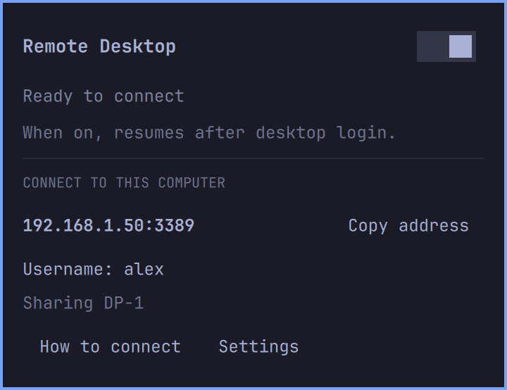

# Remote Desktop for Omarchy

Access your existing Omarchy desktop over RDP from Windows, Mac, Android or
iPhone. Windows and Android are user-tested; Mac and iPhone are untested.

Windows and Android use, audio mirroring and logout/login have been reported
successful by the project owner. Mac and iPhone are expected to work through
Microsoft Windows App, but have not been tested with this plugin.
Platform-specific evidence and outstanding release checks
are recorded in [compatibility](docs/COMPATIBILITY.md).



[Settings screenshot](screenshots/settings.png) · [Connection help](screenshots/connection-help.png)

Screenshots use sample connection details.

## Simple setup

1. Open **Remote Desktop** in the Omarchy bar.
2. Install a compatible backend when prompted, then click **Check again**.
3. Choose a physical monitor and your LAN or existing private-VPN address.
4. Create RDP credentials (or generate a password), save them, and click
   **Enable Remote Desktop**.

The compact panel shows status, address, username and copy buttons. Windows
connection files and connection instructions are one click away. Settings contains monitor/network selection, credential replacement and audio. The main toggle remembers your choice: On resumes access
after desktop login; Off keeps access off after reboot. **Share audio** plays sound on both this computer and the
remote device; when off, sound stays local. Installing the plugin itself never starts remote access.

**Backend packaging limitation:** upstream stable `hypr-rdp` v0.1.5 does not have
the password-file or session-hook interfaces required by this plugin. The current
development source does. The plugin refuses incompatible binaries and never
silently replaces them with a moving Git build. Setup offers an explicit
**Install RDP backend** action. It opens a terminal, explains the pinned
build and asks before downloading/building/installing it. The archive has a fixed
SHA-256 checksum, Rust dependencies use the upstream lockfile, and pacman handles
dependency/installation prompts. Installing the stable package alone currently
cannot finish setup. Building can take several minutes and several GB of disk.

## Install the plugin

```sh
omarchy plugin add https://github.com/kostadinkadiev/omarchy-remote-desktop.git --enable
```

Requirements: Omarchy's Quickshell shell, Hyprland 0.54+, Python 3.10+, systemd
user services, OpenSSL, iproute2 and a compatible `hypr-rdp` binary on PATH.
The backend also requires its normal graphics/capture and audio dependencies.
Use the desktop's existing Wayland environment; do not run the helper as root.

## Connect

**Windows:** open Remote Desktop Connection (`mstsc`), enter the displayed
`address:port`, and use the RDP username/password you created. Alternatively,
copy the exported `Omarchy.rdp` file to Windows and open it. Exports are saved to
`~/.config/omarchy-remote-desktop/exports/` and contain no password.

**Mac:** install Microsoft's Windows App, choose **Add PC**, then enter the same
address and RDP credentials. You can also import the exported `.rdp` file.

Mac has not yet been tested with this plugin.

**Android:** use Microsoft Windows App, add the displayed address as a PC, and
enter your RDP credentials. For a Tailscale address, connect Tailscale first.

**iPhone:** use Microsoft Windows App, add a PC with the displayed address, and
enter your RDP credentials. For a Tailscale address, connect Tailscale first.
iPhone has not yet been tested with this plugin.

On the first connection, compare the certificate's SHA-256 fingerprint with
**How to connect** in the plugin before accepting it. The certificate is
self-signed and retained across restarts; it is not a public CA identity.

Your RDP password is separate from your Linux password. If the desktop is locked,
normal Omarchy unlock is still required after RDP authentication. See the acceptance checklist for recorded client tests.

## What is shared

- One selected physical monitor. Its contents remain visible locally.
- Keyboard and pointer control; the backend's clipboard sharing is active.
- Audio only if enabled in Settings.

No virtual desktop, separate user session, pre-login access, wake-on-LAN or local
screen blanking is provided. Locking, display power saving and sleep remain under
Omarchy's normal controls. A sleeping or logged-out machine cannot be reached.
[Server Mode](https://github.com/0x1ocean/omarchy-server-mode) is an optional power
management companion, not a dependency. Preventing sleep does not guarantee a
closed-lid monitor stays capturable.

## Network access

Choose an RFC1918 LAN address or an existing VPN address in those ranges or
`100.64.0.0/10` (including Tailscale). Version one supports IPv4 only and never
binds to all interfaces. A VPN does not need to be installed by this plugin.

Both machines need a route to the selected address. Binding an interface does
not restrict who can reach it: your firewall and VPN policy control peer access.
The plugin does not change firewall rules, install VPNs or forward router ports.

If Windows cannot connect, first try `Test-NetConnection <address> -Port 3389`
in PowerShell (use your configured port). Check that the panel says **Ready**,
both machines are on the chosen network, and the host firewall permits TCP only
from the intended peer or trusted subnet. Adjust your existing firewall policy
explicitly; do not disable it or expose the port to the public internet.

**Ready** means this plugin's backend owns the listening socket. **Connected**
means the backend reported an established session. Neither proves that a different
computer can reach the server or that the release has passed compatibility tests.

## Lifecycle and removal

Access runs in `omarchy-remote-desktop.service`, independently of the bar. Shell
reloads do not interrupt it. Logout stops it. Missing credentials, a missing
monitor/network, backend failure, plugin disable or plugin removal stop serving.
Automatic recovery to a different monitor or address is never attempted.

The panel switch turns access off and cancels startup after login. Saving settings
stops the old session; **Save settings** restarts it if sharing was on and keeps
it off otherwise.
Password replacement therefore disconnects existing clients.

To remove configuration and credentials, choose **Settings → Remove setup →
Confirm removal**, then remove the plugin:

```sh
omarchy plugin remove kokd.remote-desktop
```

Removing only the plugin stops the running backend but retains your private
configuration. Complete cleanup remains available before removal through:

```sh
python3 ~/.config/omarchy/plugins/kokd.remote-desktop/bin/remote-desktopctl remove
```

Shared packages and other remote desktop servers are never removed or stopped.

## Development and validation

```sh
python3 -m unittest discover -s tests -v
omarchy plugin validate .
```

Run `tests/check-qml` on Omarchy for QML linting and Qt runtime tests. Add
`--live-panel` to briefly exercise a mock panel on the actual Wayland desktop.
`python3 tests/backend-smoke /path/to/hypr-rdp --live` checks missing/empty secrets
and localhost-only NLA negotiation; it does not establish a desktop session.
The helper
can be inspected without enabling access using `bin/remote-desktopctl check` or
`bin/remote-desktopctl status`. The machine-readable CLI always emits bounded JSON.
Configuration is accepted only as JSON on stdin, never as password-bearing flags.

See [security](SECURITY.md) and [compatibility](docs/COMPATIBILITY.md). MIT licensed.
